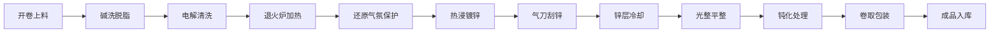

## 1. 产品概述

镀锌线带钢热镀锌业务客户端软件是面向镀锌车间生产管理的工业级软件系统，用于对带钢从开卷到成品入库的全流程进行实时监控与参数控制。

- **主要用途**：镀锌车间退火、镀锌和钝化工艺的生产管理与过程控制
- **目标用户**：车间操作员、工艺工程师、生产管理人员
- **核心价值**：实现热镀锌生产全流程数字化管控，提升产品质量稳定性与生产效率

## 2. 核心功能

### 2.1 用户角色

| 角色 | 注册方式 | 核心权限 |
|------|----------|----------|
| 操作员 | 系统管理员创建 | 监控生产状态、调整工艺参数、记录生产日志 |
| 工艺工程师 | 系统管理员创建 | 工艺参数配置、质量数据分析、工艺优化 |
| 管理员 | 系统初始化 | 用户管理、系统配置、权限分配 |

### 2.2 功能模块

1. **开卷清洗**：带钢开卷脱脂清洗控制与监控
2. **退火炉**：炉温分区控制、还原气氛管理
3. **热浸镀锌**：锌锅温度控制、锌花调节、锌层附着力监测
4. **气刀控制**：气刀刮锌参数、锌层重量闭环控制
5. **锌层冷却**：镀层冷却曲线监控与调节
6. **光整钝化**：光整平整控制、钝化涂层质量监控
7. **卷取包装**：成品卷取、包装入库管理

### 2.3 页面详情

| 页面名称 | 模块名称 | 功能描述 |
|----------|----------|----------|
| 总览面板 | 生产总览 | 全线状态概览、关键指标实时显示、产量统计 |
| 开卷清洗 | 开卷清洗 | 开卷机状态、脱脂液浓度、清洗温度、带钢张力监控 |
| 退火炉 | 退火炉 | 多温区温度曲线、炉内气氛、露点、氢气含量控制 |
| 热浸镀锌 | 热浸镀锌 | 锌锅温度、铝含量、锌液成分、浸镀时间控制 |
| 气刀控制 | 气刀控制 | 气刀压力、距离、角度、锌层厚度在线检测 |
| 锌层冷却 | 锌层冷却 | 冷却风机转速、带钢温度曲线、冷却速率控制 |
| 光整钝化 | 光整钝化 | 光整延伸率、轧制力、钝化液浓度、涂层厚度 |
| 卷取包装 | 卷取包装 | 卷取张力、钢卷直径、包装规格、入库登记 |
| 质量追溯 | 质量管理 | 锌层重量检测、附着力测试、表面质量评级 |

## 3. 核心流程

带钢从开卷机出发，经过碱洗脱脂、电解清洗、退火炉加热与还原、热浸镀锌、气刀刮锌控制锌层厚度、锌层冷却凝固、光整平整、钝化处理，最后卷取包装入库。

## 4. 用户界面设计

### 4.1 设计风格

- **主色调**：深炭灰 `#1A1D24` 作为背景，工业橙 `#FF6B00` 作为强调色
- **辅助色**：钢青色 `#2A4A6B`、警示黄 `#FFC107`、状态绿 `#00C853`、报警红 `#D50000`
- **按钮风格**：工业风方正设计，轻微倒角，悬浮时有金属光泽动画
- **字体**：显示器字体 JetBrains Mono 用于数据显示，Inter 用于界面文字
- **布局风格**：仪表盘式布局，多卡片监控面板，左侧导航栏，顶部状态栏
- **图标风格**：线性工业图标，状态指示灯采用圆形发光效果

### 4.2 页面设计概览

| 页面名称 | 模块名称 | UI元素 |
|----------|----------|--------|
| 总览面板 | 生产总览 | 全线流程图、实时数据卡片、产量趋势图、告警列表 |
| 各工艺模块 | 工艺控制 | 参数调节面板、实时曲线图表、状态指示、控制按钮 |
| 质量追溯 | 质量管理 | 数据表格、质量统计图表、历史记录查询 |

### 4.3 响应式

- 桌面端优先设计，适配1920×1080及以上工业显示器
- 支持1280×1024车间触控平板自适应
- 触控按钮尺寸≥44px，适合戴手套操作

### 4.4 视觉效果

- 数据卡片采用金属质感边框，悬浮时轻微上浮
- 状态指示灯带有发光动画效果
- 实时曲线图采用渐变色填充
- 工艺流程图带钢运行方向有流动光效动画
