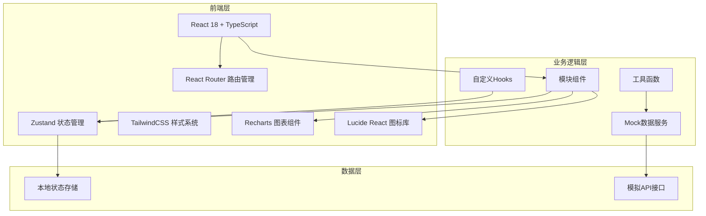
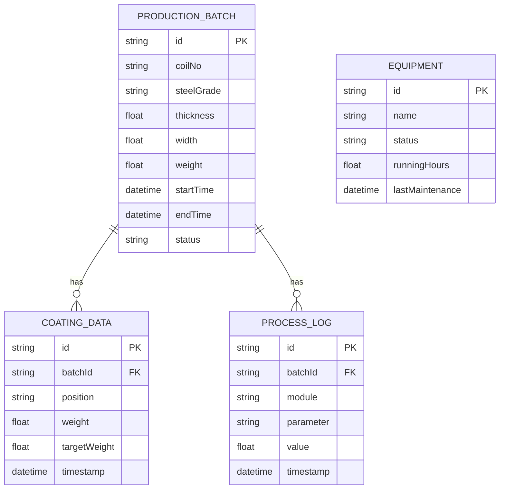

## 1. 架构设计



## 2. 技术描述

- **前端**：React@18 + TypeScript@5 + TailwindCSS@3 + Vite@5
- **初始化工具**：vite-init react-ts 模板
- **路由管理**：react-router-dom@6
- **状态管理**：zustand@4
- **图表组件**：recharts@2
- **图标库**：lucide-react@0.294
- **后端**：无，采用Mock数据模拟实时生产数据
- **数据持久化**：localStorage 存储用户配置

## 3. 路由定义

| 路由 | 页面用途 |
|------|----------|
| / | 生产总览面板 |
| /uncoiling | 开卷清洗模块 |
| /annealing | 退火炉模块 |
| /galvanizing | 热浸镀锌模块 |
| /air-knife | 气刀控制模块 |
| /cooling | 锌层冷却模块 |
| /passivation | 光整钝化模块 |
| /coiling | 卷取包装模块 |
| /quality | 质量追溯管理 |

## 4. 数据类型定义

```typescript
// 工艺参数基础类型
interface ProcessParameter {
  id: string;
  name: string;
  value: number;
  unit: string;
  min: number;
  max: number;
  target: number;
  status: 'normal' | 'warning' | 'alarm';
  trend: 'up' | 'down' | 'stable';
}

// 温度区类型
interface TemperatureZone {
  id: string;
  name: string;
  setPoint: number;
  actual: number;
  deviation: number;
}

// 生产批次信息
interface ProductionBatch {
  id: string;
  coilNo: string;
  steelGrade: string;
  thickness: number;
  width: number;
  weight: number;
  startTime: Date;
  endTime?: Date;
  status: 'pending' | 'running' | 'completed' | 'scrapped';
}

// 锌层检测数据
interface CoatingData {
  id: string;
  batchId: string;
  position: 'left' | 'center' | 'right';
  weight: number;
  targetWeight: number;
  deviation: number;
  timestamp: Date;
}

// 设备状态
interface EquipmentStatus {
  id: string;
  name: string;
  status: 'running' | 'idle' | 'maintenance' | 'fault';
  runningHours: number;
  lastMaintenance: Date;
}
```

## 5. 数据模型

### 5.1 数据模型ER图



### 5.2 Mock数据结构

- 实时数据：每2秒更新一次模拟实时监控数据
- 历史数据：生成最近24小时的趋势数据用于图表展示
- 生产批次：模拟当前在制批次和近100条历史批次记录
- 质量检测：每卷模拟3个检测位置的锌层重量数据
